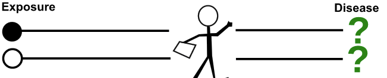

# Overview of epidemiological studies

## Goals of epidemiological studies 

* Identify causal relations between 
    + determinant of diseases (environmental, genetic) or   medication 
    + health outcome 
* Example: 
    + determinant: exposure to tobacco products
    + health outcome: occurence of lung cancer 
    
## Quantifying association between exposure and health outcome    

Golden standard: randomized controlled trial 

Example: assessment of effect of tobacco  

* Select a group of **non smoker** individuals
* Assign **randomly** some individuals to the treatment group (smokers)
* Assign **randomly** remaining individuals to control group (non smokers)
* Compute **risk** in each group
* Compute **relative risk** and conclude
   

## Quantifying association: risk and risk ratio

* As seen earlier, risk defined as:
$$R = \frac{\mbox{number of cases of cases of disease} }{\mbox{number of persons at risk}}$$

can be computed in treatment group and in control group

* Relative risk:
$$ R = \frac{\mbox{R}_{treatment}}{\mbox{R}_{control}}$$

Relative risk larger than 1 indicative of  causal effect of exposure

## Quantifying association: odds and odds ratio

* Other currency in risk assessment: **odds**

$$O = R / 1-R$$

Less straightforward interpretation than risk $R$ but carry the same information

* Odd ratio
$$OR = \frac{ R_E / 1-R_E}{ R_{NE} / 1-R_{NE}}$$

($E$ and $NE$ standing for exposed and non exposed)

$OR>1$ indicative that exposure increases odss (hence increases risk)

## Quantifying association: why bothering with odds? 

* Converting odds into risk and vice versa is simple algebra
* $RR$ and $OR$ carry the same information but no simple formula relating them 
* Only $OR$ can be computed in  case-control studies (cf slides below) 
* $OR$ good approximation of $RR$ for rare diseases (*rare disease assumption*) 
* $OR$ built-in output of a *logistic regression* (regression-like statistical method to study binary measurement such as presence/absence of disease)

## RCT versus other types of studies

* Randomization attempts to **break potential dependence** between tobacco and other potential causal factors.
    + For example: exposure to air pollution
    + In this case air pollution would be a **confounder**

* Tobacco/lung cancer example unrealistic: 
    + unethical 
    + prohibitive follow-up time 
    
* Cohort studies and case control studies aim at avoiding these issues 
    + *observational* rather than *interventional*
    + case-control studies a *retrospective* rather than *prospective* 

## Main types of studies

* RCT
* Cohort studies
* Case-control studies
* Cross-sectionnal studies 

## Characteristics of epidemiological studies 

* Aspects of epidemiological studies: 
    + Allocation of determinants: interventional / observational 
    + Occurence of disease: prospective / retrospective 
    + Time span: cross-sectionnal / longitudinal 
    
    + Measure of outcome: incidence / prevalence 
    + Sampling: sample based / census
    + Unit of observation: individual / group 
    
    
## Reading

* P. Bofetta, Overview of study design,  Chapter 16 of *Epidemiology and Biostatistics* 
T. Zheng, P. Boffetta and P. Boyle, 2011 

# Cohort studies

## Simplest cohort study design

 * Select a group of healthy exposed people
 * Select a group of  healthy unexposed people (control or non factor group)
 * Follow up across a period meaningful w.r.t health coutcome considered
 
{width=250px} 

## Key aspects 

* Goal: linking determinants to one or various outcomes
* Longitudinal, prospective, observational study 
    + Designer of study has **no influence on exposure**
    + Exposure is a consequence of life style, medical prescription...
* Term *cohort* reminiscent of ancient Roman army: group  480 soldiers that would remain together throughout their whole life.
* Most often follows only a *sample* (subset) of the population of interest 

 
## Advantages and disadvantages

* Advantages
    + follows sequence of happenings
    + well suited to follow many health outcome or diseases at the same time
    
* Disadvantages
    + expensive and time consuming
        - economic variant: retrospective cohort study 
    + not well suited for diseases with long latency
    + not well suited for rare diseases
    + may be subject to *study effect* 
    + change in exposure difficult to monitor
    + attrition

## Considerations for data analysis 

* Computation of risks and  relative risk is straightforward

* How to treat persons lost to follow up? 
    + Disregarding all data relative to persons lost to follow up: statistically legit.  
    + General statistical issue known as **censoring**
    + Statistical techniques tailored for this: *Kaplan-Meier* estimator of survival function

## Reading

* P. Bofetta, Cohort study,  Chapter 18 of *Epidemiology and Biostatistics* 
T. Zheng, P. Boffetta and P. Boyle, 2011 

# Case-control studies

## Case-control studies in a nutshell

Design attempting to alleviate two of the main issues of cohort studies: 

* time prohibitive 
* difficulty to obtain large number of cases for rare diseases 

Simplest case-control study design:

* Select a group of  people with disease 
* Select a group of  healthy people
* Retrieve information about past exposure of individuals in each group
 
{width=250px} 

## Advantages and disadvantages 

* Advantages 
    + No waiting time: quicker and cheaper than cohort studies
    + Can study several risk factors simultaneously
    + Well suited to investigate rare diseases
    + Require smaller sample sizes than cohort studies 
    + Effect of transient risk factors easy to study 

* Disadvantages 
    + Difficulty to identify precedence of disease and factor
    + Requires careful handling of morbidity vs.  mortality 
    + Can study only on health outcome 
    + Can not estimate risk and odds, only OR and estimate of RR
    + Subject to erros and bias when retrieving information

<!-- ## Selection of cases  -->

## Reading  

Zheng T., P. Boyle, Y. Zhang and  N. Li, Case-control study,  Chapter 19 of *Epidemiology and Biostatistics*  T. Zheng, P. Boffetta and P. Boyle, Eds, 2011 

# Clinical trials 

## Main aspects of clinical trials

* Aimed at understanding the safety and efficacy of medication 
* **Prospective** and **interventional**
* Organized in succesive **phases**
    + pre-marketing phasesd I-III: increasing focus on efficacy, increasing sample size ($n \sim 10 - 1000$)
    + post-marketing (phase IV): equal focus on efficacy and safety, longer follow-up period, insight on rare events ($n \sim 10000$)
    * Steps taken in data collection and analysis summarized *beforehand* in  **study protocol** 

## Protocol components

* Justification / rationale of study
* Objectives
* Study population (incl. / excl. criteria)
* Design 
    + specifications of various arms
    + randomization 
    + blinding
    + patient population 
    + sample size
    + duration and number of sites 
* Schedule
    + Baseline evaluation
    + Treatment 
    + Follow-up 

## Protocol components (cont')

* Ethical and regulatory considerations
* Clinical aspects of drug and comparators administration
* Enpdloints
* Clinical assessment
* Completion and withdrawal
* Data management
* Data analysis 
* Confidentiality aspects
* Publication policy
* References 

## Reading

* R.W. Makuch and Y.Y Zhou, Issues in the design, conduct and analysis of clinical trials,  Chapter 17 of *Epidemiology and Biostatistics* 
T. Zheng, P. Boffetta and P. Boyle, 2011 

<!-- # Cross-sectionnal studies -->

<!-- # Proportional mortality studies -->

<!-- # Case-crossover studies -->

<!-- # Ecologic studies -->
